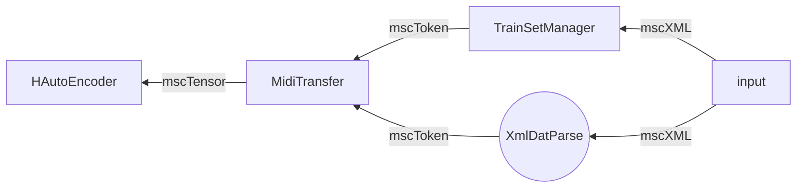

# Welcome to MusTransfer!

System is constructed on Adaconda with the environment uploaded.


# How to use

## Find some music with the xml format

You may get some in [Musescore](https://musescore.com/dashboard)
**Note:** Musical xml should only contains **piano solo**

## Running

Merge two music with command
```predict.py mscXML1 mscXML2 <max_measure_number>```
if either mscXML1 or mscXML2 has **measure_number** less than **<max_measure_number>**, it may cause error.
> Merged musical file will be outputed with name **merge1** and **merge2**, you can alter the names by motifying predict file manually.

# System Pipline




> Musical file processing procedure.
## Model discription

